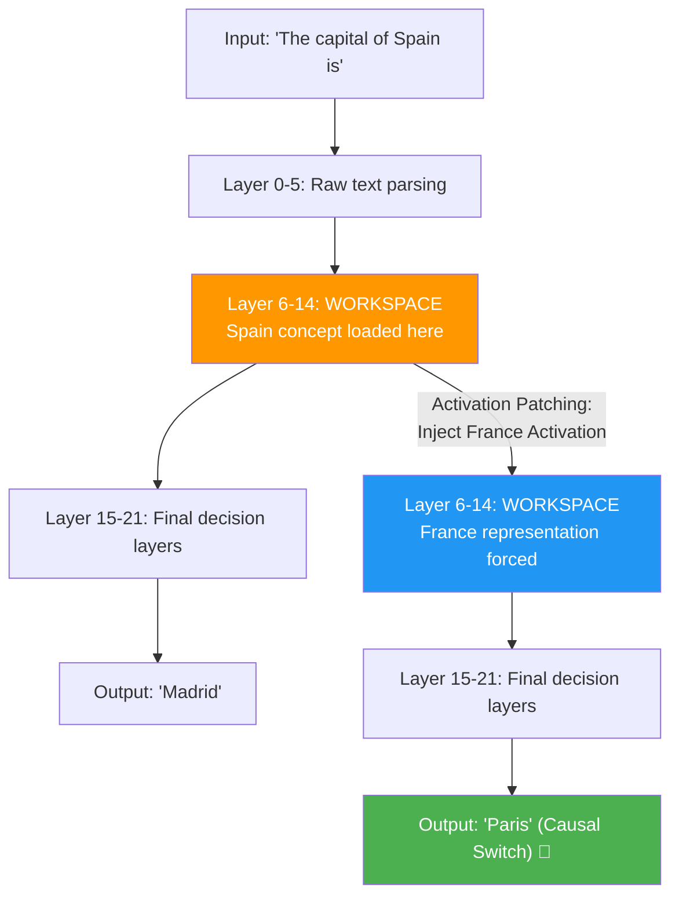

# Verbalizable-Representations-Form-a-Global-Workspace-in-TinyLlama

# 🧠 Jacobian Lens & Activation Patching on TinyLlama: Mechanistic Interpretability

This repository contains a clean, PyTorch-based implementation of the concepts introduced in the research paper [**"Verbal representation of hidden states"** (The Global Workspace / Jacobian Lens paper)](https://transformer-circuits.pub/2026/workspace/index.html). 

Using **TinyLlama-1.1B**, this project demonstrates how to probe, patch, and ablate intermediate concept representations in the residual stream of a transformer model to causally influence its outputs.

---

## 📖 The Core Idea: What is a "Global Workspace"?

When an LLM processes text, it does not jump to the final answer immediately. Information propagates through a sequence of decoder layers (e.g., 22 layers in TinyLlama). 

The paper proposes that intermediate layers act as a shared **Global Workspace** where abstract concepts (e.g., `"France"`, `"Germany"`, `"language"`) are loaded, updated, and manipulated before the final layer outputs a word.

This repository explores three fundamental techniques:
1. **The Jacobian Lens (J-Lens):** A mathematical translator to decode "half-processed" activations in intermediate layers into readable vocabulary tokens.
2. **Activation Patching:** A causal surgery technique that replaces the internal activations of one concept with another to steer the model's factual recall.
3. **J-Space Ablation:** Deleting specific concept subspaces to verify how critical they are for multi-hop reasoning.

---

## 🛠️ Step-by-Step Code & Output Walkthrough

Here is a breakdown of the cells in the notebook, what the code accomplishes, and the scientific takeaways of the outputs.

---

### Cell 1: Environment Setup
```python
!pip install transformers accelerate torch matplotlib numpy tqdm -q
```
Installs the required deep learning and visualization libraries inside the Google Colab environment.

---

### Cell 2 & 3: Library Imports & Model Initialization
Loads **TinyLlama-1.1B-Chat-v1.0** in half-precision (`float16`) onto the GPU.
* **Tokenizer:** Splices input strings into tokens.
* **Model:** The 22-layer transformer neural network.

---

### Cell 4 & 5: PyTorch Hook Manager (`LlamaHookManager`)
Since PyTorch does not expose intermediate activations by default, we build a hook manager to tap into specific decoder layers.

#### The Building Analogy:
> Imagine the 22 layers of TinyLlama as a 22-story building. 
> * **Layer 0 (Ground Floor):** Raw input tokens.
> * **Layer 11 (Middle Floors):** Intermediate reasoning.
> * **Layer 21 (Top Floor):** Final word prediction.
> 
> The `HookManager` acts as a **CCTV camera system** installed on each floor. It captures layer activations (snapshots of the model's thoughts), gradients (for J-lens training), and intercepts outputs to perform surgeries (interventions).

`Cell 5` performs a safety flush to ensure any stale hooks from failed runs are cleared out.

---

### Cell 6 & 7: The Jacobian Lens Implementation & Calibration
At intermediate layers, representations are high-dimensional vectors ($d=2048$) that are difficult to read directly. The **Jacobian Lens (J-Lens)** acts as a linear translator mapping intermediate states to vocabulary logits.

#### Mathematical Formulation:
$$\text{Logits}_{\ell} = \text{LM\_Head}(\text{RMSNorm}(h_\ell \cdot J_\ell^T))$$
Where:
* $h_\ell$ is the hidden state at layer $\ell$.
* $J_\ell$ is the estimated Jacobian matrix at layer $\ell$ (calibrated via Vector-Jacobian Products).

We calibrate the J-lens over 20 diverse sentences (`Cell 7`) using local VJP approximations to minimize cross-position token noise.
* **Output:** `Calibration completed over 504 tokens.`

---

### Cell 8: Figure 1 — J-Lens Readout Grid (Heatmap)
```python
plot_jlens_grid("The capital of France is Paris")
```
Decodes the top predicted token at *every* token position for *every* layer.

#### Visual Interpretation:
* **Layers 0–5:** Decoded outputs are chaotic/noisy as early layers are parsing syntax.
* **Layers 8–12:** The concept of `France` emerges strongly at the `"France"` position.
* **Layers 15+:** The word `Paris` begins to dominate at the terminal position before being officially generated.
* **Takeaway:** This confirms that the model stores and refines semantic concepts layer-by-layer.

---

### Cell 9: Figure 2 — Rank Trajectories (Line Graph)
```python
plot_token_trajectories(
    prompt="The official language of Germany is",
    target_tokens=["Germany", "German", "language", "English"],
    target_pos=-1
)
```
Plots the log-rank of specific target tokens across all 22 layers.

#### Trajectory Analysis:
* **Layers 0–5:** All target tokens reside at a low rank ($>10,000$).
* **Layers 8–12:** Both `Germany` and `German` jump rapidly up the rank hierarchy ($\sim 100 \to \sim 10$), indicating the concept workspace has loaded them.
* **Layers 15–20:** `German` reaches rank **#1**, while `Germany` drops back down.
* **Unrelated tokens (e.g., `English`):** Remain low-ranked throughout.
* **Takeaway:** Concepts rise into the "global workspace" at intermediate layers before the output token is finalized.

---

### Cell 10 & 11: Causal Intervention via Coordinate Swapping (Figure 3)
Swaps the J-lens coordinate coefficients of concept $A$ (`Germany`) with concept $B$ (`France`) and plots next-token probabilities.

#### Swapping Results:
* **Clean Run:** `German` next-token probability is $\sim 0.95$.
* **Swapped Run:** `German` next-token probability collapses to $\sim 0.0$ while `French` rises.
* **Takeaway:** Modifying the J-space coordinates directly suppresses the model's factual retrieval target.

---

### Cell 12: ⭐ The Main Result — Activation Patching
```python
activation_patch_and_generate(
    prompt_clean="The capital of Spain is",
    prompt_patch="The capital of France is",
    token_to_patch_str="Spain",
    swap_layers=swap_layers
)
```

Instead of using abstract prediction vectors (J-lens vectors), we perform **Causal Activation Patching**:
1. Run a reference pass with `"The capital of France is"` and record the real input activations of `"France"` at index 4 across L6–L18.
2. Run the target pass with `"The capital of Spain is"`.
3. Force-replace the activation at the `"Spain"` token position with the recorded `"France"` activations.

#### The Results:
```text
============================================================
CLEAN PROMPT   : The capital of Spain is
PATCH PROMPT   : The capital of France is
CLEAN OUTPUT   : Madrid.
PATCHED OUTPUT : Paris.
============================================================

============================================================
CLEAN PROMPT   : The language spoken in Spain is
PATCH PROMPT   : The language spoken in Germany is
CLEAN OUTPUT   : Castilian Spanish, which is a dialect
PATCHED OUTPUT : German.
============================================================
```

> [!IMPORTANT]
> **This is the causal smoking gun:** The prompt text read by the model was `"The capital of Spain is"`. We did **not** change the input text. By replacing the internal hidden activation of the country concept in the workspace, we overrode the model's reasoning, prompting it to output `"Paris."` and `"German."` respectively.

---

### Cell 13: Figure 5 — J-Space Ablation
We remove (project out) the top-$k$ J-lens directions from the hidden state at intermediate layers to verify if the workspace is necessary for reasoning.

#### Performance Degradation Analysis:
* **No Ablation:** High probability for correct answers on both simple and complex tasks.
* **Light Ablation (L8-12):** Minimal effect.
* **Medium to Heavy Ablation (L6-20):** 
  * Direct Factual Recall (e.g., `"The capital of France is"`) declines moderately.
  * Multi-hop Reasoning (e.g., `"The animal that spins webs has a body with legs numbering"`) **collapses entirely to near-zero**.
* **Takeaway:** Multi-hop reasoning tasks require intermediate representations inside the workspace to pass information between steps. Without it, reasoning breaks down.

---

## 🎓 Summary of Discoveries



* **Correlation:** The Jacobian Lens allows us to translate intermediate hidden vectors into vocabulary space, proving the existence of structured concept tracks.
* **Causation:** Activation patching demonstrates that the model's factual retrieval can be redirected by manipulating these intermediate tracks, bypassing the written text.
* **Necessity:** J-space ablation proves that intermediate concept representations are essential for performing multi-hop reasoning.

---

## 🚀 Running the Notebook
You can run this project in Google Colab using a free T4 GPU tier. 
1. Open the notebook uploaded in this repo.
2. Follow the cell execution sequentially.
3. Observe the generated Matplotlib charts and text patching outputs.
